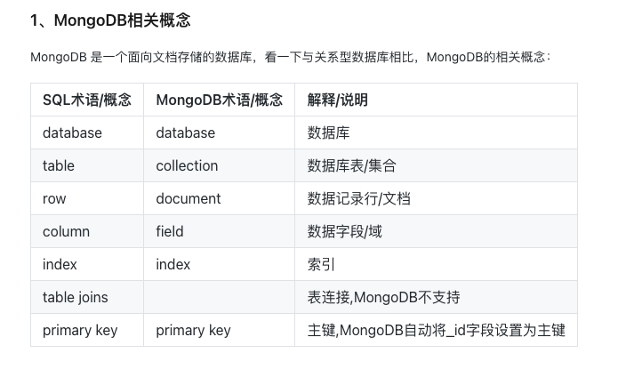

# springboot3-use
 Summarize the knowledge points used in daily development of springboot3.X


### 1. springboot helloworld 需要引入
```xml
        <dependency>
            <groupId>org.springframework.boot</groupId>
            <artifactId>spring-boot-starter-web</artifactId>
            <version>RELEASE</version>
            <scope>compile</scope>
        </dependency>
```
### 2 springboot 项目分层 并配置相应信息
- 项目分层
- 不同参数请求 post get
- 统一返回结构体封装

### 3 springboot 项目支持热部署 数据校验 封装swagger 
- 项目分层、统一接口封装、参数校验、异常处理- 
```xml
       <dependency>
            <groupId>org.springframework.boot</groupId>
            <artifactId>spring-boot-devtools</artifactId>
            <optional>true</optional> <!-- 可以防止将devtools依赖传递到其他模块中 -->
        </dependency>
```
### 4. 多版本接口提供,多环境切换(todo)
### 5. springboot 集成swagger、集成 smartDoc

### 6. springboot 访问外部接口的几种方式
### 7. springboot 如何保障接口幂等性
### 8. springboot 实现接口限流(单实例、分布式)
### 9. springboot 集成mysql 基于JPA的封装 (oracle PostgreSQL)
- docker 初始化mysql 命令
```text
   docker run -itd --name springboot3_mysql -p 3306:3306 -e MYSQL_ROOT_PASSWORD=123456 mysql
```
- 创建数据库 + 创建表执行脚本
```sql
    create database springboot3_test;
```
----
- docker 初始化postgres 命令
```text
  docker run --name springboot3_postgres -p 5432:5432 -e POSTGRES_PASSWORD=123456 postgres
```
- 创建数据库 + 创建表 执行脚本
```sql
    create database springboot3_test;
```

### 10. springboot 集成mysql mybatis(xml、注解方式)
### 11. springboot 集成mysql 分页插件 pageHelper
- mybatis + xml + 自动生成代码 + 分页插件(done)
- [MyBatis Generator 配置详情参考](https://ost.51cto.com/posts/11866)
- 生成代码命令
```text
mvn mybatis-generator:generate -X -e
```

### 12. springboot 集成mysql 多数据源配置
- 创建数据库+ 表+ 添加表数据
```sql
create database springboot3_test2
create table Book(
    id          int auto_increment primary key,
    author      varchar(64)  not null comment '作者信息',
    name        varchar(64)  not null comment '书籍名称',
    price       decimal      not null comment '价格',
    createTime  datetime     null comment '上架时间',
    description varchar(128) null comment '书籍描述'
);

INSERT INTO Book (id, author, name, price, createTime, description) VALUES (1, '金庸', '笑傲江湖', 13, '2020-12-19 15:26:51', '武侠小说');

INSERT INTO Book (id, author, name, price, createTime, description) VALUES (2, '罗贯中', '三国演义', 14, '2020-12-19 15:28:36', '历史小说');
```
- 配置 各个数据库数据源  master + slave datasource 

### 13. springboot 集成mysql - mybatis-plus 代码自动生成、基于字段隔离多租户
### 14. springboot 集成shardJDBC
### 15. springboot 集成数据库连接池 DBCP、C3P0、HikariCP (对比不同数据库连接池的区别)
### 16. springboot 集成数据库脚本管理工具 flyway liquibase
### 17. springboot 集成redis(jedis三种连接方式(单机、分片、集群)) / RedisTemplate、Jedis、lettuce、Redission 区分
- docker 安装 redis
```text
    docker run -itd --name redis-test -p 6379:6379 redis
```
- redis 四种序列化方式
  - JDK 序列化方式 （默认）
  - String 序列化方式 (较长使用)
  - JSON 序列化方式 (占用空间太大)
  - XML 序列化方式 (很少使用)

  - Spring Boot 集成 Redis 时，默认使用 JdkSerializationRedisSerializer 进行对象序列化和反序列化。但是，
    这种序列化方式有一些问题，例如效率低下，占用内存高等。因此，通常情况下建议使用其他序列化方式。
  - Spring Boot 提供了多种序列化方式，例如 JSON、Jackson、FastJson、Protobuf、Kryo 等。其中，
    使用 JSON 序列化的方式是比较常见的选择，因为 JSON 格式的数据在传输和存储上都比较便捷。

  - lettuce和jedis区别
    jedis连接Redis服务器是直连模式，当多线程连接下使用jedis会存在线程安全问题，解决方案可以通过配置连接池使每个连接专用（会严重影响性能）
    
    lettuce 基于netty框架进行与Redis服务器连接，底层设计中采用 StatefulRedisConnection，StatefulRedisConnection自身是线程安全的，
    可以保障并发访问安全问题，一个连接可以被多路复用。同时lettuce也支持多连接一起工作。
    lettuce 是redis的默认客户端技术

  - 添加注解方式 + 分布式锁
    - @RedisLock
      public void xxxMethod() {
      }

### 18. springboot 集成分布式锁
 - done 
### 19. springboot 集成 MongoDB

- docker 安装MongoDB
```text
$ docker run -itd --name mongo -p 27017:27017 mongo --auth

-p 27017:27017 ：映射容器服务的 27017 端口到宿主机的 27017 端口。外部可以直接通过 宿主机 ip:27017 访问到 mongo 的服务。
--auth：需要密码才能访问容器服务。

$ docker exec -it mongo mongo admin
# 创建一个名为 admin，密码为 123456 的用户。

>  db.createUser({ user:'admin',pwd:'123456',roles:[ { role:'userAdminAnyDatabase', db: 'admin'},"readWriteAnyDatabase"]});
# 尝试使用上面创建的用户信息进行连接。

> db.auth('admin', '123456')

```

### 20. springboot 集成ES、kafka、rocketMQ
### 21. springboot 集成websocket  netty
### 22. springboot 集成Schedule ExecutorService
### 23. springboot 集成定时任务  quart、quartz cluster、elastic-job、xxl-job
### 24. springboot 集成文件上传下载、断点续传
### 25. springboot 集成文件 POI、EasyPOI 导入导出 Excel world
### 26. springboot 集成导出PDF
### 27. springboot 异步编程 @Async  Reactive
### 28. springboot 应用部署(jar、war  tomcat(jetty,undertow)) 、docker、 docker compose 
### 29. springboot 集成监控 actuator、springboot admin、Prometheus + grafana 


### 3 springboot 配置日志
- 比较日志不同 log4j  log4j2 logback
  - 介绍配置日志需要考虑的事项
    - 日志路径，日志级别level (debug、info、error)
    - 日志配置
    - 日志大小、日志保存天数
    - 定义日志输出信息
    - 根据不同环境设置不同日志级别(dev、test、uat、product)
    - spring-logback.xml
    ```xml
    <?xml version="1.0" encoding="UTF-8"?>
      <configuration>
    
          <!-- 日志根目录-->
          <springProperty scope="context" name="LOG_HOME" source="logging.path" defaultValue="/data/logs/springboot-logback-demo"/>
    
          <!-- 日志级别 -->
          <springProperty scope="context" name="LOG_ROOT_LEVEL" source="logging.level.root" defaultValue="DEBUG"/>
    
          <!--  标识这个"STDOUT" 将会添加到这个logger -->
          <springProperty scope="context" name="STDOUT" source="log.stdout" defaultValue="STDOUT"/>
    
          <!-- 日志文件名称-->
          <property name="LOG_PREFIX" value="spring-boot-logback" />
    
          <!-- 日志文件编码-->
          <property name="LOG_CHARSET" value="UTF-8" />
    
          <!-- 日志文件路径+日期-->
          <property name="LOG_DIR" value="${LOG_HOME}/%d{yyyyMMdd}" />
    
          <!--对日志进行格式化-->
          <property name="LOG_MSG" value="- | [%X{requestUUID}] | [%d{yyyyMMdd HH:mm:ss.SSS}] | [%level] | [${HOSTNAME}] | [%thread] | [%logger{36}] | --> %msg|%n "/>
    
          <!--文件大小，默认10MB-->
          <property name="MAX_FILE_SIZE" value="50MB" />
    
          <!-- 配置日志的滚动时间 ，表示只保留最近 10 天的日志-->
          <property name="MAX_HISTORY" value="10"/>
    
          <!--输出到控制台-->
          <appender name="STDOUT" class="ch.qos.logback.core.ConsoleAppender">
              <!-- 输出的日志内容格式化-->
              <layout class="ch.qos.logback.classic.PatternLayout">
                  <pattern>${LOG_MSG}</pattern>
              </layout>
          </appender>
    
          <!--输出到文件-->
          <appender name="0" class="ch.qos.logback.core.rolling.RollingFileAppender">
          </appender>
    
          <!-- 定义 ALL 日志的输出方式:-->
          <appender name="FILE_ALL" class="ch.qos.logback.core.rolling.RollingFileAppender">
              <!--日志文件路径，日志文件名称-->
              <File>${LOG_HOME}/all_${LOG_PREFIX}.log</File>
    
              <!-- 设置滚动策略，当天的日志大小超过 ${MAX_FILE_SIZE} 文件大小时候，新的内容写入新的文件， 默认10MB -->
              <rollingPolicy class="ch.qos.logback.core.rolling.TimeBasedRollingPolicy">
    
                  <!--日志文件路径，新的 ALL 日志文件名称，“ i ” 是个变量 -->
                  <FileNamePattern>${LOG_DIR}/all_${LOG_PREFIX}%i.log</FileNamePattern>
    
                  <!-- 配置日志的滚动时间 ，表示只保留最近 10 天的日志-->
                  <MaxHistory>${MAX_HISTORY}</MaxHistory>
    
                  <!--当天的日志大小超过 ${MAX_FILE_SIZE} 文件大小时候，新的内容写入新的文件， 默认10MB-->
                  <timeBasedFileNamingAndTriggeringPolicy class="ch.qos.logback.core.rolling.SizeAndTimeBasedFNATP">
                      <maxFileSize>${MAX_FILE_SIZE}</maxFileSize>
                  </timeBasedFileNamingAndTriggeringPolicy>
    
              </rollingPolicy>
    
              <!-- 输出的日志内容格式化-->
              <layout class="ch.qos.logback.classic.PatternLayout">
                  <pattern>${LOG_MSG}</pattern>
              </layout>
          </appender>
    
          <!-- 定义 ERROR 日志的输出方式:-->
          <appender name="FILE_ERROR" class="ch.qos.logback.core.rolling.RollingFileAppender">
              <!-- 下面为配置只输出error级别的日志 -->
              <filter class="ch.qos.logback.classic.filter.LevelFilter">
                  <level>ERROR</level>
                  <OnMismatch>DENY</OnMismatch>
                  <OnMatch>ACCEPT</OnMatch>
              </filter>
              <!--日志文件路径，日志文件名称-->
              <File>${LOG_HOME}/err_${LOG_PREFIX}.log</File>
    
              <!-- 设置滚动策略，当天的日志大小超过 ${MAX_FILE_SIZE} 文件大小时候，新的内容写入新的文件， 默认10MB -->
              <rollingPolicy class="ch.qos.logback.core.rolling.TimeBasedRollingPolicy">
    
                  <!--日志文件路径，新的 ERR 日志文件名称，“ i ” 是个变量 -->
                  <FileNamePattern>${LOG_DIR}/err_${LOG_PREFIX}%i.log</FileNamePattern>
    
                  <!-- 配置日志的滚动时间 ，表示只保留最近 10 天的日志-->
                  <MaxHistory>${MAX_HISTORY}</MaxHistory>
    
                  <!--当天的日志大小超过 ${MAX_FILE_SIZE} 文件大小时候，新的内容写入新的文件， 默认10MB-->
                  <timeBasedFileNamingAndTriggeringPolicy class="ch.qos.logback.core.rolling.SizeAndTimeBasedFNATP">
                      <maxFileSize>${MAX_FILE_SIZE}</maxFileSize>
                  </timeBasedFileNamingAndTriggeringPolicy>
              </rollingPolicy>
    
              <!-- 输出的日志内容格式化-->
              <layout class="ch.qos.logback.classic.PatternLayout">
                  <Pattern>${LOG_MSG}</Pattern>
              </layout>
          </appender>
    
          <!-- additivity 设为false,则logger内容不附加至root ，配置以配置包下的所有类的日志的打印，级别是 ERROR-->
          <logger name="org.springframework"     level="ERROR" />
          <logger name="org.apache.commons"      level="ERROR" />
          <logger name="org.apache.zookeeper"    level="ERROR"  />
          <logger name="com.alibaba.dubbo.monitor" level="ERROR"/>
          <logger name="com.alibaba.dubbo.remoting" level="ERROR" />
    
          <!-- ${LOG_ROOT_LEVEL} 日志级别 -->
          <root level="${LOG_ROOT_LEVEL}">
    
              <!-- 标识这个"${STDOUT}"将会添加到这个logger -->
              <appender-ref ref="${STDOUT}"/>
    
              <!-- FILE_ALL 日志输出添加到 logger -->
              <appender-ref ref="FILE_ALL"/>
    
              <!-- FILE_ERROR 日志输出添加到 logger -->
              <appender-ref ref="FILE_ERROR"/>
          </root>
      </configuration>

    ```
    - Profile 相关的配置可以参考:
    ```xml
    <?xml version="1.0" encoding="UTF-8"?>
        <configuration>
            <include resource="org/springframework/boot/logging/logback/base.xml" />
        
             <!-- roll by day -->
             <appender name="FILE" class="ch.qos.logback.core.rolling.RollingFileAppender">   
                <rollingPolicy class="ch.qos.logback.core.rolling.TimeBasedRollingPolicy">   
                    <fileNamePattern>logs/springboot-logback-demo.%d{yyyy-MM-dd}.log</fileNamePattern>   
                    <maxHistory>30</maxHistory>  
                </rollingPolicy>   
                <encoder>   
                    <pattern>%d{yyyy-MM-dd HH:mm:ss.SSS} [%thread] %-5level %logger{35} - %msg%n</pattern>   
                </encoder>  
            </appender> 
           
            <!-- dev -->
            <logger name="org.springframework.web" level="INFO"/>
                <root level="INFO">
                <appender-ref ref="FILE" />
            </root>
        
            <!-- test or production -->
            <springProfile name="test,prod">
                <logger name="org.springframework.web" level="INFO"/>
                <logger name="com.pdai.springboot" level="INFO"/>
                <root level="INFO">
                    <appender-ref ref="FILE" />
                </root>
            </springProfile>
        
        </configuration>
    ```